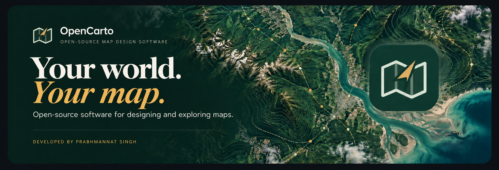
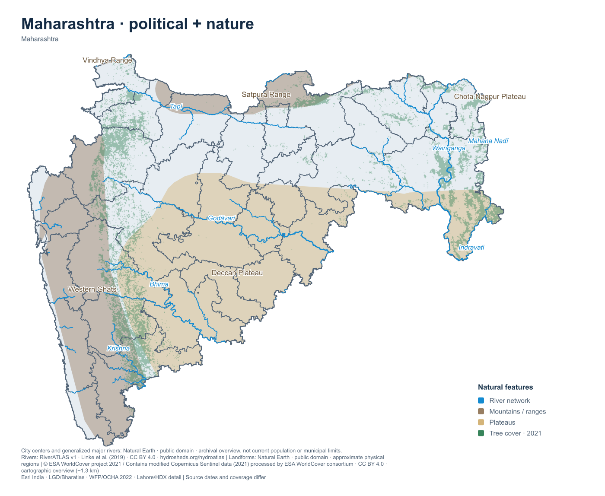
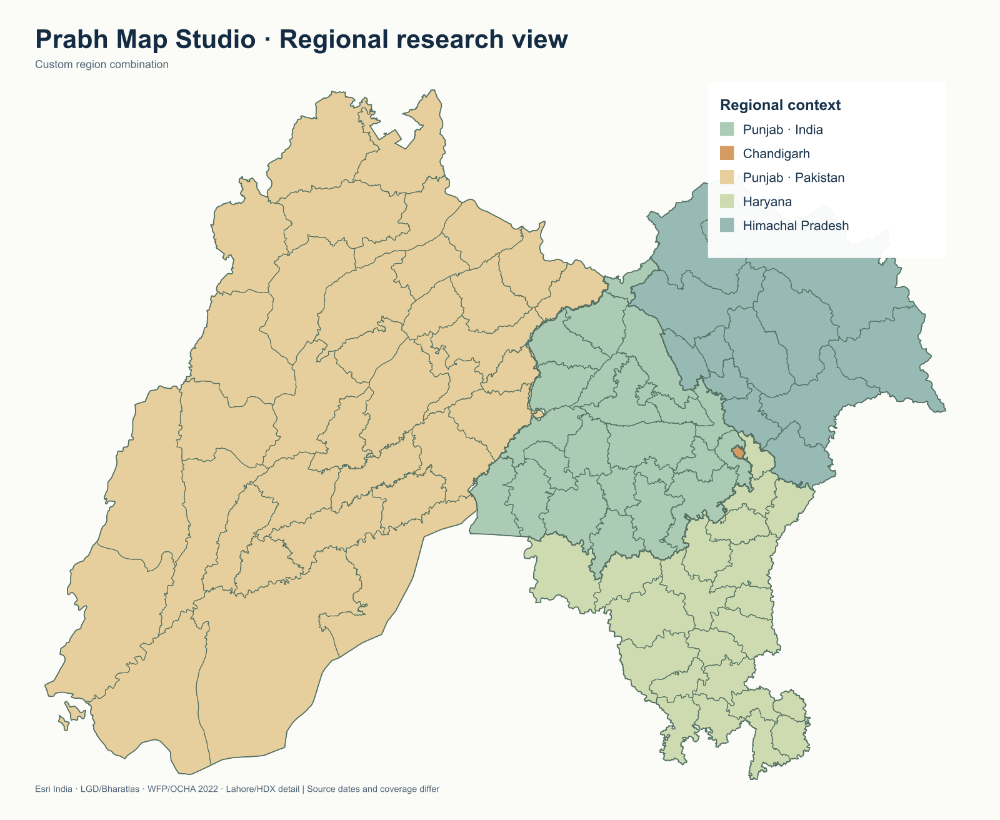
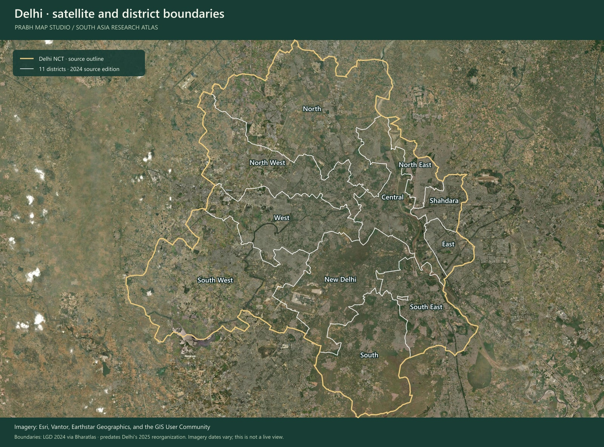
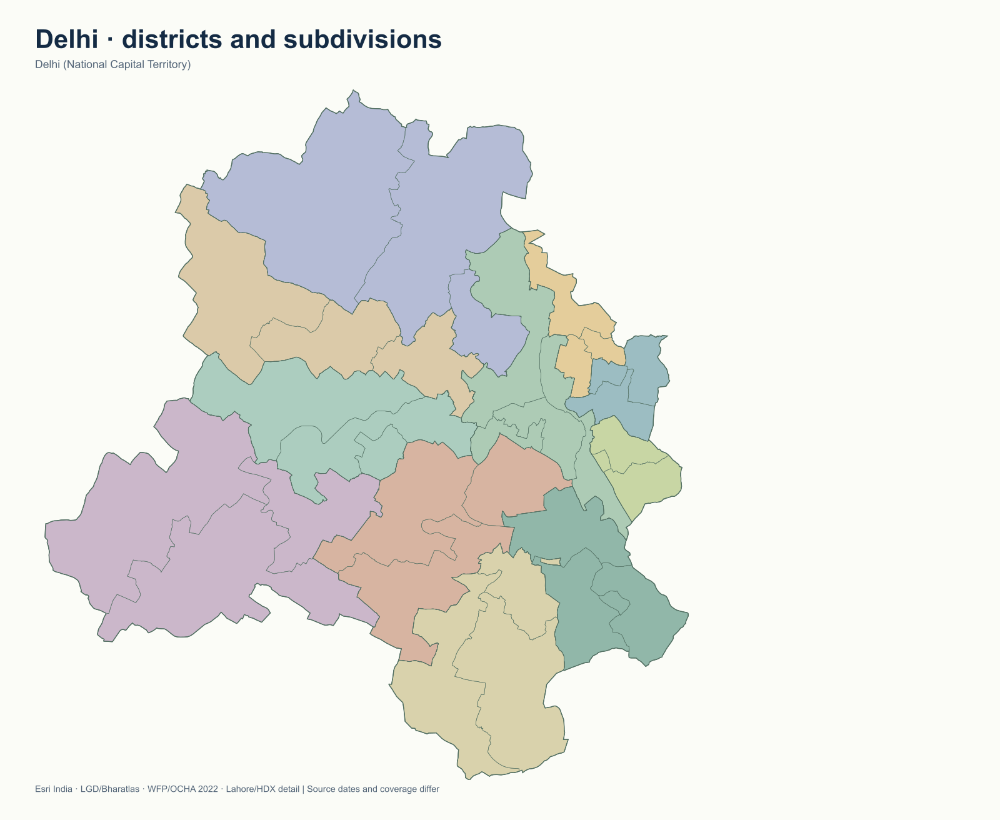
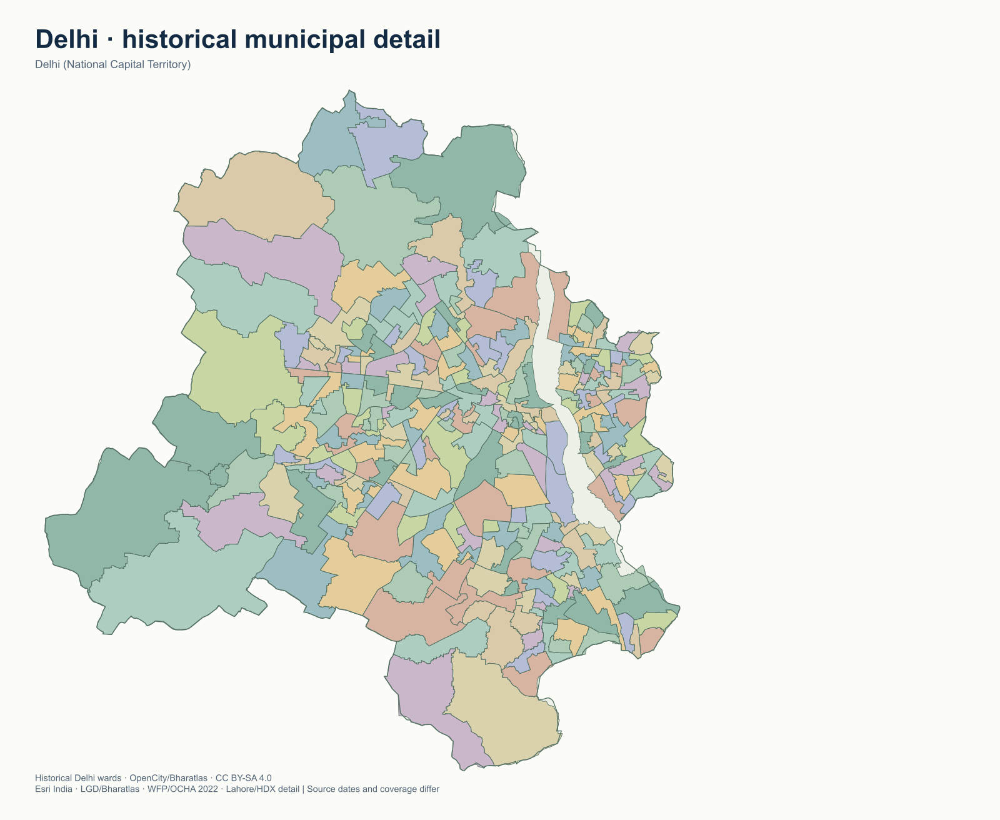
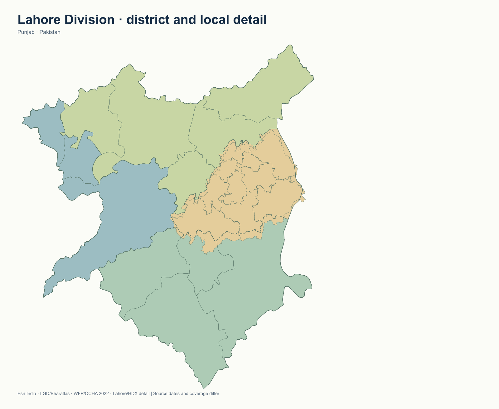
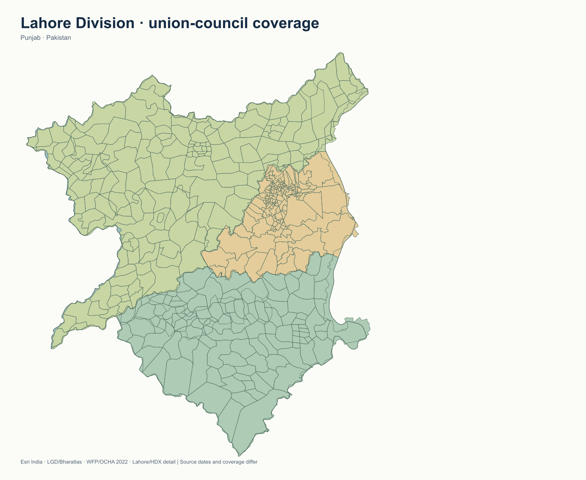
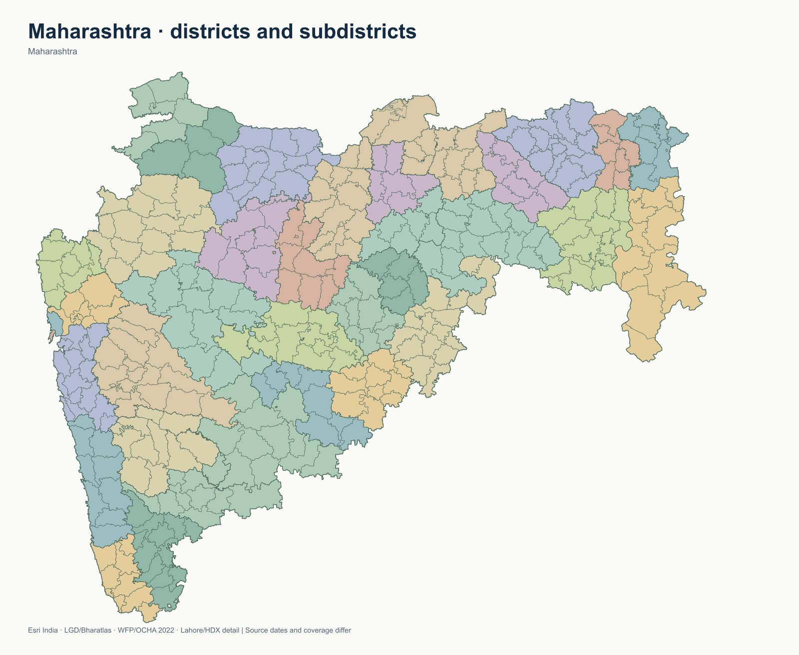
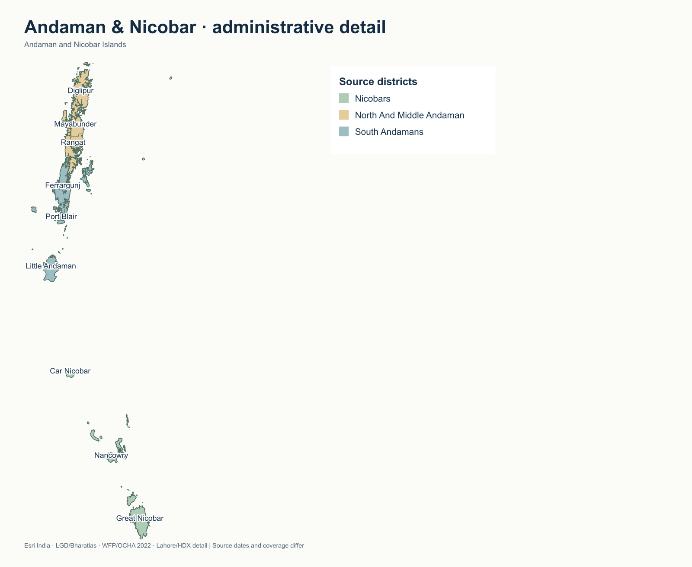

# OpenCarto

**Open-source map design software for South Asia.**
Create, style, and export custom maps for research and education.
Developed and created by **Prabhmannat Singh (Prabh)**.

Explore real administrative boundaries, build regional comparisons, style maps,
and export your work for research, education, and geographic exploration. The
atlas includes Punjab, Indian states and union territories, neighbouring South
Asian countries, and documented Tibetan administrative context. Coverage and
source dates vary; the detailed notes below explain what each layer represents.

[Get started](#run-locally) · [Map gallery](#map-gallery) · [Workspace](#workspace-controls) · [Coverage](#indian-boundary-coverage) · [Developer](#developer) · [License](#license)

## What you can do

- **Explore regions:** isolate a country, state/province, division, district or subdivision; combine territories with a searchable geographic picker.
- **Build research views:** individual regions, custom combinations, Tricity and editable Historic Punjab context.
- **Style your map:** colors, patterns, labels, borders, legends and map backgrounds.
- **Add nature:** 232,370 regional river reaches, mountain ranges, plateaus and a 2021 tree-cover overview over political maps.
- **Inspect and measure:** area source information, approximate path distances, and shape tools for coloring, clearing or hiding areas.
- **Add context:** cities, Delhi metro lines, a 300-entry gurdwara directory, 123 sourced shrine map locations and 65 credited photographs.
- **Keep and share your work:** local autosave, undo/redo, settings files, and PNG, SVG or JPG exports.

### Search the atlas and manage visibility

Open **Layers**, **Areas**, or **Search map** above the map. The shared **Map
detail** controls let you apply one level to the **Visible map** (your selected
geography, regardless of zoom) or **All regions** (including regions shown later).
Choose outlines only, provinces/states, districts, tehsils/subdivisions, divisions
or wards/union councils. Detail is limited to the source levels available.

Search an existing country, state, district or subdivision and use **Show / Hide**.
**Show** adds an out-of-scope area without losing your existing selections;
**Only this** isolates it. **Inside this area** changes only that parent's detail:
choose tehsils in one district, **Area only** to hide its subdivisions, or **Use
map setting** to remove its override. Area type and region filters distinguish
repeated names. No missing source geometry is invented.

Use the compact **Borders** switches for state/country, district and tehsil lines;
**More border levels** offers province, division and ward/UC lines. These switches
apply to the whole map and leave fills visible. Advanced controls remain below.

**Hidden areas only** helps recover hidden selections; **Unhide all areas** removes
manual hides. Hiding a parent also hides its descendants. Showing a child restores
its hidden ancestors. Hidden polygons are removed from parent fills, overlay masks
and exports. Paints, names, local detail and borders persist through undo/redo,
autosave, Save/Load and PNG/SVG/JPG exports.

### Historical empire views

Open **History** for the **Mauryan Empire (c. 250 BCE)**, **Mughal Empire (late
17th century)** or **Sikh Empire (1839)**. Selecting a preset opens the full
available map and colors modern districts whose source label points lie within
the dated reference extent. Choose **Districts + tehsils / subdivisions** to
color the finer units independently. The empire color is editable. Hide/Unhide,
undo/redo, autosave, Save/Load and PNG/JPG/SVG export remain available.

These are coarse comparisons using modern boundaries, not exact historical
frontiers. Border units can straddle territory; local autonomy, nominal control,
enclaves and frontier changes are not resolved. Each preset in
[the history source manifest](app/empire-data.json) records its reference map,
date, method, uncertainty and license. The Mauryan reconstruction follows
Joppen's traditional envelope, the Mughal reconstruction follows the Library of
Congress map's late-17th-century nominal extent, and the Sikh reconstruction uses
John Walker's map of territory at Ranjit Singh's death. Their assumptions differ.
Turning History off restores the user's retained paints. Census overlays also
retain those paints while showing their own colors on a neutral background.

### Sikh military & heritage case study

In **History → Case study**, load **Sikh military & heritage · United Punjab core**.
It reproduces the supplied scenario’s selection and colors: all 23 Indian Punjab
districts and Chandigarh, selected Pakistani Punjab districts and partial tehsils,
and twelve specific KP frontier tehsils. The panel lists included units and
exclusions and shows the supplied reference image. **Focus Lahore selection**
zooms to City, Shalimar and Cantonment; Model Town and Raiwind are excluded.

This is an editable **hypothetical / alternate-history administrative case study**,
not a dated Sikh Empire frontier or a current political or legal boundary.
Military and heritage labels are commemorative scenario names. Existing atlas
boundary editions are retained; the three Lahore polygons are from OpenStreetMap,
retrieved 10 October 2026 UTC (11 October in India), newer than the reference’s
August snapshot. The [case-study manifest](app/case-study-data.json) records the
selection and image hash; [Lahore provenance](app/case-study-lahore-sources.json)
records relation IDs, versions, coordinates, dates and **ODbL-1.0** attribution.
The reference image retains its supplied source terms.

The preset loads ordinary editable paints and display names. Undo restores the
previous map. Its caption and boundary qualification carry into exports.

### Custom area names

Use **Areas → Rename** on any district, tehsil, subdivision, region or other source
area. You can also select an area on the map and use the **pencil** in the vertical
editing toolbar. Enter **Name on your map** and choose **Save name**.
**Reset name**, a blank name or the original name restores the source label.
Search finds both custom and original names.

Display names appear on the map, in inspection and searches, and in SVG/PNG/JPG
exports. They survive autosave, Save/Load and undo/redo. Renaming leaves boundary
IDs, parent links and census records unchanged; the original source name remains
visible in the name editor.

### Demographics and community shrines

Open **People**, beside **Nature**, to display the largest reported mother-tongue
group, largest religious group, population, literacy (age 7+) or urban population
share. The bundled **2011 Census of India** profiles cover **32 Indian state/UT
regions**, derived from official C-16, C-01 and Primary Census Abstract tables.
Records include counts, source URLs, table hashes, year and boundary notes.
Largest-group maps show a plurality, which can be below 50%; language is reported
mother tongue, not official-language status. Derived language remainders are
excluded from largest-group ranking.

Religion additionally includes **5,974 verified Indian Census 2011 area profiles:
495 districts and 5,479 tehsils/subdivisions**. Pakistan Punjab **Census 2023 Table
9** adds 340 atlas profiles across its two boundary editions: 36 districts in
each edition, plus 133 legacy and 135 full-country tehsil profiles. These duplicate
editions are alternative map views; their counts must not be added together.
Each record keeps its census year and the source's eight reported categories.
Use the **Religion administrative
level** control to switch between state, district and tehsil maps. Choose either
**Largest religious group** or **Religion population share** for a specific
community. The floating key shows categories or six percentage ranges and lets
you change the community colors. The people button in the vertical editing
toolbar opens district religion maps directly. **Inspect area** displays all eight
religion counts and percentages for a matched unit; profile search finds other
units without inventing a parent average.

Names/codes are matched conservatively against official state C-01 tables, with
split or conflicting districts withheld. **1,272 Indian source units** have no
reliable match. Pakistan Punjab joins use exact normalized district/tehsil names
and explicit spelling aliases; changed Lahore subdivisions and ambiguous combined
units are withheld. Other neighbouring-country local religion statistics remain
unavailable. A category absent from a source is not treated as zero.
See [matching rules and reproduction instructions](docs/religion-area-data.md),
[full source/count audit](app/religion-area-data.json), and the compact runtime
projection. State-level language and other indicators retain the original
whole-region coverage: later Andhra Pradesh/Telangana and Jammu & Kashmir/Ladakh
splits remain unshaded at that level. Dadra & Nagar Haveli and Daman & Diu combine
the two 2011 UT totals. Districts and tehsils never receive a state average.
The map's later boundary editions can differ from census geography. These are
historical aggregates, not current estimates or descriptions of every resident.

**Community shrines** adds representative Hindu, Muslim, Buddhist, Jain, Christian
and Sikh sites with searchable cards, photo pins, community filters, popups and
**Show on map**. The existing 300-entry Sikh directory remains in **Places**.
Photo authors, licenses, identity/location sources and capture dates when known
are retained in `app/community-shrines.json` and `app/gurdwara-photo-sources.json`.
Photos are bundled locally and embedded with attribution metadata in SVG exports.
The collection is selected, not a census of religious sites. Census choropleths,
legends and shrine photos carry into PNG/JPG/SVG exports and saved map settings.

Run `npm run check:demographics` for source/data/model checks and
`npm run check:demographics-browser` with the app on port 4545 for browser checks.
Run `npm run check:history-religion` and
`npm run check:history-religion-browser` for empire geography, religious count
reconciliation, palettes, district/tehsil coverage, exports and mobile behavior.
To reproduce the Census values, install `openpyxl` and `xlrd` for Python, then run
`python scripts/import-demographic-census.py --input-dir work/census-2011 --download`.
The importer verifies the three pinned workbook hashes and reconciles language
and religion totals before replacing the JSON. Later source editions require
reviewing the manifest rather than silently accepting changed inputs.

### View multiple states or territories together

Open **Explore a region… → Combine states & territories…** above the map.
Search and check any available states, territories or countries, then click
**Show regions together**. The **Punjab + Haryana + Delhi** preset selects
Indian Punjab, Haryana and Delhi NCT in one click. Remove selected chips or use
**Clear selection** to build another combination; changes apply when you click
Show. Reopen the same option to edit your group. Colors, natural layers and
detail settings carry over, and the combination is included in autosave and
Save/Load. Use **Layers** to adjust district and subdivision detail.

## An open-source alternative to MapChart and paid map makers

OpenCarto is a **free, open-source MapChart alternative for South Asia map
design**. Use it to create political maps, color administrative areas, combine
territories, add natural features, and export maps for research and education.
[MapChart](https://www.mapchart.net/) also offers free map-making tools, with
additional features available through [MapChart Plus](https://www.mapchart.net/plus.html).

For South Asia map styling and static exports, OpenCarto can also serve as an
alternative to paid mapping tools such as
[Scribble Maps Pro](https://help.scribblemaps.com/hc/en-us/articles/6798561696269-Features-Comparison)
and [Mapme](https://mapme.com/pricing/). OpenCarto includes editable regional
groupings, local project saves, and PNG, SVG and JPG exports without a software
subscription. Its source code is available under the [MIT License](LICENSE).

These comparisons focus on map design and static exports. Geographic coverage,
hosted publishing, collaboration and analysis capabilities differ by product.

## Political maps with natural features

*An actual studio export with all four natural layers enabled. Administrative
boundaries remain visible above the shading; natural features are clipped to the
selected state. Mountain and plateau outlines are approximate, and tree cover is
an overview rather than a current forest inventory.*

1. Open **Layers → Geographic view**. Choose a country, then a state/province,
   division, district or local subdivision where the source provides that level.
2. Click **Show only this**, or **Add to group** to combine territories. Search
   by name and remove selection chips to refine the group. Use the detail buttons
   for province, division, district, subdivision and ward layers.
3. Open **Nature**, choose **Political + nature** or toggle individual features.
   Set colors, shading opacity, names and river density. **River study** enables
   the denser tributary view. Your existing area colors are retained.
4. Export SVG, PNG or JPG. SVG retains vector rivers/landforms and embeds the
   tree-cover image with geographic clipping and attribution.

| Natural layer | Coverage and source |
| --- | --- |
| Rivers / tributaries | **232,370 unique RiverATLAS v1 reaches** intersect the bundled atlas extent. Regional uses Strahler order 5+; More tributaries uses order 3+. Derived at ~500 m; smaller streams and canals are incomplete. Major names use Natural Earth. [RiverATLAS, Linke et al. (2019)](https://www.hydrosheds.org/hydroatlas), **CC BY 4.0**. |
| Mountains and plateaus | **39 Natural Earth physical regions**, clipped to selected boundaries. These are approximate named ranges, foothills and plateaus, not terrain contours or surveyed limits. [Source](https://www.naturalearthdata.com/downloads/10m-physical-vectors/10m-physical-labels/), **public domain**. |
| Forests / tree cover | Cartographic **ESA WorldCover 2021** WMS overview at ~1.3 km map pixels. Includes some plantations; small woods/mixed pixels may be absent. Not the analytical 10 m product and not suitable for forest-area measurement. [Source](https://esa-worldcover.org/en/data-access), **CC BY 4.0**. |

Tree cover attribution: **© ESA WorldCover project 2021 / Contains modified
Copernicus Sentinel data (2021) processed by ESA WorldCover consortium**.
[River provenance and hashes](app/river-network-sources.json) ·
[Landform and tree-cover provenance](app/nature-sources.json) ·
[Nature data licenses](NATURE-DATA-LICENSES.md).

The datasets are bundled locally. River tiles load for the selected geography;
a worker performs network and landform clipping. A feature is absent when the
source has no coverage in that selection. All settings support autosave,
Save/Load and undo/redo. Existing source boundary coordinates are unchanged.

**Editing tools:** Inspect (`I`) shows an area's source and offers fit/isolate/hide.
Measure (`M`) sums approximate geodesic segments, not road or terrain distances;
measurements are temporary and excluded from exports. Shape tools select area
label points and offer **Color**, **Clear colors**, or **Hide**. Finish a polygon
with the check button or Enter; Escape cancels. Painting, picking and navigation
retain their existing shortcuts.

## A map made with the studio

*An actual application export, rendered as a PNG for this README. Colors illustrate
regional groupings; they do not encode a statistical measurement. Source credits
are retained in the image. This is a regional example of the wider atlas.*

## Map gallery

The administrative maps are exported from the studio's bundled boundary layers. Click an image
to open the full-size version. Colors distinguish administrative areas and do not
represent population or another statistical measure. All available source areas
for each illustrated detail level are included; source gaps and historical
editions are retained. [Gallery counts and provenance](docs/images/gallery-provenance.json).

### Satellite view — Delhi

*Satellite imagery with the studio's Delhi boundary data. This documentation
illustration uses the same **Esri World Imagery** service as the app's Satellite
background. Gold marks the NCT outline; white lines mark the 11 districts in the
LGD-derived 2024 source, before the 2025 reorganization. Imagery dates vary;
this is not a live view.*

Imagery: **Esri, Vantor, Earthstar Geographics, and the GIS User Community**.
[Imagery source and terms](https://goto.arcgisonline.com/maps/World_Imagery) ·
[Map provenance](docs/images/gallery-provenance.json).
In the app, choose **Satellite** in the map-background selector to explore this view.

### Delhi — administrative divisions and municipal detail

| Districts and subdivisions | Historical wards and charges |
| --- | --- |
|  |  |
| **11 districts · 34 subdivisions** from the LGD-derived 2024 snapshot. | **289 named areas:** 272 MCD wards, 9 NDMC charges and 8 Cantonment charges. |

The administrative example predates Delhi's December 2025 reorganization; the
municipal example depicts the historical source arrangement, not today's 250 MCD
wards. Municipal source: OpenCity via Bharatlas, **CC BY-SA 4.0**.
See [Delhi coverage and source details](#delhi-explorer-finer-detail-and-metro).

### Lahore — division, district and local coverage

| Division and administrative detail | Union-council coverage |
| --- | --- |
|  |  |
| **4 districts · 22 local detail areas:** Lahore, Kasur, Sheikhupura and Nankana Sahib, with the retained tehsil/town-detail layer. | **428 source union-council polygons** across the division, with district outlines for context. |

District outlines and standard tehsils retain WFP/OCHA 2022 geometry. The 22 local
detail areas include 10 Lahore polygons from an **unverified August 2025 upload**,
as identified in the app's catalog. Union councils retain the Alhasan Systems/HDX
source published in 2017. These mixed-edition examples show available source
coverage, not a certified current local-government register.

### Maharashtra and Andaman & Nicobar Islands

| Maharashtra | Andaman & Nicobar Islands |
| --- | --- |
|  |  |
| **36 districts · 360 named subdistrict areas.** District colors and finer subdivision borders are shown. | **3 districts · 9 subdistrict areas.** The full island chain retains its actual geographic positions and relative scale. |

Both examples use the LGD-derived 2024 snapshot via Bharatlas. Maharashtra's
unnamed source record remains excluded. See [Indian boundary coverage](#indian-boundary-coverage)
for the complete state/UT table and source qualifications.

## Developer

**Developed and created by Prabhmannat Singh — Prabh.**

OpenCarto is an independent open-source project for research, learning,
and exploring South Asia through maps.

- Developer: [Prabhmannat Singh on GitHub](https://github.com/PRABHMANNAT)
- Source code: [PRABHMANNAT/OpenCarto](https://github.com/PRABHMANNAT/OpenCarto)
- Feedback and contributions: [GitHub issues](https://github.com/PRABHMANNAT/OpenCarto/issues)

The project and repository are named **OpenCarto**. Select the logo or open **Guide** in the app for developer
information, usage notes, and source attribution.

## License

Application code and original branding are released under the [MIT License](LICENSE),
Copyright © 2026 Prabhmannat Singh (Prabh). Research is the project's focus; the
software license also permits other uses under its terms.

Geographic datasets, photographs, basemap imagery, fonts, and dependencies retain
their own licenses. See [third-party notices](THIRD_PARTY_NOTICES.md),
[country data licenses](COUNTRY-DATA-LICENSES.txt), [overlay data licenses](OVERLAY-DATA-LICENSES.txt),
and [individual photograph credits](app/gurdwara-photo-sources.json).
Retain the relevant attribution when sharing maps or redistributing assets.

Maps reflect their documented source editions and geographic qualifications.
They are intended to support research and are not certified surveys or a complete
current administrative register.

## Run locally

Requires Node.js 22.13 or newer.

    npm ci
    npm run build:vercel
    npm run preview:vercel -- --port 4545 --strictPort --host 127.0.0.1

This serves the static application used by the local preview. For active
development with the Vinext runtime, use `npm run dev -- --port 4545 --host 127.0.0.1`.
The static build is also available when the Workers development runtime is
unavailable on your machine.

Open [localhost:4545](http://localhost:4545/). Select a state from **Explore a region** to enable district and tehsil detail and fit its extent. Layers can also be toggled independently. The Tehsils tab groups source subdistrict units, including tehsils, mandals, taluks, talukas, circles, and other state-specific units. Andhra Pradesh's subdistricts are mandals. Area names appear at closer zooms. Tehsils inherit district colors unless painted individually.

## Punjab border display

The Pakistani and Indian Punjab source outlines previously left 59 enclosed
unassigned gaps along their shared frontier. Sparse display overrides align
that frontier with Indian Punjab's dissolved Esri IAB2024 district outline,
remove duplicate overlaps and assign gap slivers to existing adjoining areas.
Indian Punjab tehsil outlines use the same state edge. Original downloaded
GeoJSON, catalog IDs, label points, census joins and saved settings are retained.

The live map, selections, Hide/Unhide, demographic overlays and SVG/PNG/JPG
exports use the same display geometry. The alignment also covers the full
Pakistan view and the retained Lahore case-study units. It preserves partial
UC coverage and the case study's Model Town/Raiwind exclusions. This is a
cartographic reconciliation of source editions, not a new boundary survey.

Provenance, input/override hashes and affected IDs are in
`app/punjab-seam-sources.json`; sparse geometry files are under
`public/data/boundary-seams/`. Regenerate with
`python scripts/build-punjab-seams.py` using numpy and shapely==2.1.2.
Sliver ownership uses nearest existing boundary samples at approximately 28 m.
Run `npm run check:punjab-seams` and `npm run check:punjab-seams-browser`
with the app on localhost:4545. The browser check includes real gap pixels,
exports and Hide/Unhide.

## Saved custom maps

The floating toolbar's **Normal** button exits empire and history case-study
views. It restores the map used before entering history and retains colors,
names and settings edited afterwards. The existing History tab's Off options
use the same return behavior. Return settings are included in autosave and
named maps, so they also work after reloading or reopening a saved map.
Older historical maps without a stored earlier view return to the atlas and
remove unchanged preset styling while retaining custom edits.

Choose **View** on the floating toolbar for **Complete map**, **Selected map**
or **Focus edited area**. Complete map temporarily shows the available atlas;
Selected map restores the prior area group or combination, detail and hidden
areas. Focus edited area shows and zooms to the last area colored or inspected.
The overview retains custom colors and names. Choosing new geography from
Layers/Search replaces the remembered view with that new selection.
Run `npm run check:map-navigation` and `npm run check:map-navigation-browser`
to verify history return, overview/selection/focus, saved maps and mobile controls.

Choose **Save** (or Ctrl/Cmd+S), enter a map name, and choose **Save map**.
**My maps** keeps a searchable library of your maps. Choose **Open** to return to
a saved map, then **Save changes** to update it or **Save as new map** to keep a
separate version. Each entry can be renamed and downloaded. Duplicate names
are rejected rather than replacing another map.

Saved maps retain colors, custom area labels, hidden areas, region/detail and
border settings, demographics/history/nature layers, legends and the saved
map view. The library uses browser storage on the same device and site address;
it persists across reloads independently of the working draft's local autosave.
Use **Download current settings** in My maps for a JSON backup, and **Load** to
restore it or move it to another device. Loading a file starts an unnamed map
so saving it cannot overwrite the previously opened map.

Run `npm run check:custom-maps` and `npm run check:custom-maps-browser`
(with the app on port 4545) to verify snapshots, saving, copies, updates,
reopening, rename, duplicate handling, reload persistence, backups and mobile UI.

## Workspace controls

The map occupies the available screen height. Use the navigation rail to open:

- **Layers:** shared Map detail and border controls, plus Find & show areas. Geographic views, countries, Delhi/NCR and specialist boundary controls remain in expandable groups. Map detail starts collapsed on phones.
- **Style:** paint colors and patterns, opacity, map appearance, and legend settings. The floating tool palette also includes a quick paint color picker.
- **Areas:** the same Map detail controls and searchable Show/Hide cards, with Inside this area for per-parent detail, Only this and Rename.
- **Nature:** rivers and tributaries, mountains, plateaus, forests/tree cover, colors, opacity and physical labels.
- **Places:** cities, historic gurdwaras, and administrative labels.

Hide the inspector with the panel button for a wider map; selecting any rail section reopens it. On small screens, controls open below the map and can be closed to recover map space. **Quick views** contains the regional shortcuts, and the background selector at the upper right contains Political, Satellite, Physical, Rivers, Streets, and Cities.

**Export map** opens format, extent, and resolution settings. Choose PNG, SVG, or JPG, then Download. Save/Load, local auto-save, history, keyboard shortcuts, and the existing map editing behavior are retained. **Guide** contains coverage notes and source attribution.

Run `npm run check:workspace-browser` with the app on port 4545 for the workspace layout/navigation regression. The existing geographic browser checks also use the new navigation and export dialog.

## Indian boundary coverage

The additional Indian layers use the [LGD-derived 2024 snapshot published by Bharatlas](https://bharatlas.com/view/lgd_subdistricts), retrieved 8 October 2026. These counts describe available named source areas, **not a complete current administrative register**.

| Region | District polygons | Named subdistrict areas |
| --- | ---: | ---: |
| Haryana | 22 | 81 |
| Himachal Pradesh | 12 | 123 |
| Andhra Pradesh | 26 | 671 mandals |
| Rajasthan | 50 | 314 |
| Uttar Pradesh | 75 | 316 |
| Uttarakhand | 13 | 80 |
| Jammu & Kashmir | 20 | 75 |
| Ladakh | 2 | 6 |
| Arunachal Pradesh | 26 | 185 |
| Assam | 35 | 172 |
| Bihar | 38 | 533 |
| Chhattisgarh | 33 | 164 |
| Goa | 2 | 12 |
| Gujarat | 33 | 252 |
| Jharkhand | 24 | 270 |
| Karnataka | 31 | 234 |
| Kerala | 14 | 76 |
| Madhya Pradesh | 52 | 416 |
| Maharashtra | 36 | 360 |
| Manipur | 16 | 39 |
| Meghalaya | 12 | 39 |
| Mizoram | 11 | 26 |
| Nagaland | 16 | 112 |
| Odisha | 30 | 476 |
| Sikkim | 6 | 9 |
| Tamil Nadu | 38 | 300 taluks |
| Telangana | 33 | 587 mandals |
| Tripura | 8 | 23 |
| West Bengal | 23 | 368 |
| Andaman and Nicobar Islands | 3 | 9 |
| Dadra and Nagar Haveli and Daman and Diu | 3 | 3 |
| Delhi (NCT) | 11 | 34 |
| Lakshadweep | 1 | 10 |
| Puducherry | 4 | 8 |

Rajasthan's district edition and tehsil parent codes are not synchronized: 17 district polygons lack linked subdistrict records. Source parent links are retained, not guessed or spatially split. Arunachal Pradesh's Itanagar capital complex source district has no linked subdistrict records. One unnamed Maharashtra subdistrict record is excluded. These gaps appear in the region cards and Guide; named source records are not fabricated to fill them. Later reorganizations and new tehsils may be absent. Same-parent fragments of Loharu and Bhopalsagar are grouped as multipart areas. The two source Kanth records have different parent districts and remain separate. Named records without LGD codes retain stable source-object IDs; no codes are invented. Unnamed claimed-extent placeholders are excluded from district/tehsil listings.

Provenance, download URLs, coverage gaps, counts, and SHA-256 hashes are in app/indian-region-sources.json. Full source coordinates are retained; MapLibre tiles and generalizes them for interactive display.

## Delhi explorer, finer detail and metro

The **Delhi explorer** in **Layers → Delhi & NCR** offers Delhi NCT, Old Delhi / New Delhi city focuses, north/east/south/west source district contexts, NDMC, Cantonment, Noida, Gurugram and NCR. City-focus boxes only move the camera; they do not introduce a new boundary. The 2024 revenue source has 11 districts and 34 named subdivision records. [Delhi's government confirms reorganization into 13 districts in December 2025](https://dmnorthwest.delhi.gov.in/); this app does not invent polygons for that newer arrangement. Old Delhi city focus is not the 2026 Old Delhi district.

**Boundary detail → Fine municipal detail** adds 289 named historical areas: 272 MCD wards, 9 NDMC charges and 8 Cantonment charges, from [OpenCity via Bharatlas](https://bharatlas.com/view/wards_delhi), **CC BY-SA 4.0**. One unnamed polygon is excluded. This is not today's 250-ward MCD map, and municipal wards are not revenue subdivisions. Municipal filters, colors, visibility and save/load work independently of revenue layers. Retain the attribution and share-alike license when redistributing this derived layer.

**Delhi NCR** uses the [NCR Planning Board's constituent list and April 2018 map](https://ncrpb.nic.in/ncrconstituent.html): NCT Delhi, 14 Haryana districts, 8 Uttar Pradesh districts and legacy Alwar/Bharatpur in Rajasthan. The displayed extent is an exact union of the app's source polygons; legacy Rajasthan extent is reconstructed from retained subdistrict parent codes rather than guessing membership of newer split districts. **This is a mixed-edition source reconstruction, not a certified current NCR boundary.** NCR view scopes the visible atlas without deleting other regions' saved colors/preferences; choose Regional atlas or another region to leave the scope.

**Show metro lines** enables 11 source line groups (Delhi Metro, Rapid Metro Gurgaon and Noida's Aqua Line), with 293 consolidated station points. Each line has visibility and custom color controls; stations can be hidden. Tracks retain actual OpenStreetMap rail-way coordinates, not straight station-to-station links. Colors, line toggles, stations and the selected Delhi view survive save/load and undo/redo and appear in SVG/PNG/JPG exports. The metro legend is separate from administrative paint groups.

Metro data: [© OpenStreetMap contributors, ODbL-1.0](https://www.openstreetmap.org/copyright), retrieved 8 October 2026. See [Delhi Metro](https://wiki.openstreetmap.org/wiki/Delhi_Metro), [Noida Metro](https://wiki.openstreetmap.org/wiki/Noida_Metro) and the [official DMRC network map](https://delhimetrorail.com/network_map). This is an OSM snapshot, not a live timetable or a guarantee of complete current coverage. Proposed routes, RRTS and suburban rail are excluded. Same-name station points within 150m are consolidated for display, not certified interchanges. Retain OSM attribution and comply with ODbL when redistributing the database. Provenance, source IDs, licenses, processing notes and output hashes are in app/delhi-map-sources.json. Browser rendering uses bundled local GeoJSON; no live OSM request is required.

## Neighbouring countries and Tibetan context

Under **Layers → Countries & Tibetan context**, select a country to scope and fit
the map. Province/regional, district and local-unit layers have independent
switches. Use the province selector to zoom, or the Areas tab to search, paint,
hide and focus individual polygons. Province colors flow to districts and local
units unless overridden; hiding a parent hides its descendants. These settings
survive auto-save, Save/Load and undo/redo. New countries start off in the regional
atlas to avoid loading all detailed datasets at once.

| Source country/context | Province / regional units | District / equivalent | Local-unit polygons |
| --- | ---: | ---: | ---: |
| Nepal (2024) | 7 provinces | 77 districts | 775 source local units |
| Bangladesh (2023) | 8 divisions | 64 districts | 507 upazila / city areas |
| Bhutan (2020) | No separate tier | 20 dzongkhags | 205 gewogs |
| Sri Lanka (2022) | 9 provinces | 25 districts | 339 DS divisions |
| Maldives (2024) | No separate tier | 21 atoll / city areas | 1,556 source island areas |
| Myanmar (2024) | 18 state / region / special areas | 80 districts | 330 townships |
| Afghanistan (2025) | 34 provinces | 401 mapped districts | Not supplied |
| Pakistan (2022) | 7 province / territory areas | 160 districts | 577 tehsils |
| Tibet AR (2023 / 2017) | 1 modern AR | 7 prefectures / cities | 78 county source areas |
| Qinghai (2023 / 2017) | 1 modern province | 8 prefectures / cities | 41 county source areas |
| Sichuan (2023 / 2017) | 1 modern province | 21 prefectures / cities | 158 county source areas |

Counts describe **published source records, not complete current registers**.
Nepal's 775 records are not a claim about its current municipality count.
Bangladesh includes 495 upazilas and 12 city corporations. Maldives island areas
include non-inhabited source areas, not 1,556 inhabited islands. Afghanistan's
humanitarian source notes 457 designated units but supplies only 401 mapped
districts; deeper subdivisions are not invented. Bhutan and Maldives do not
receive a fictional province tier.

Pakistan's seven records include four provinces, Islamabad, and
Pakistan-administered Azad Kashmir and Gilgit-Baltistan; seven constitutional
provinces or settled sovereignty are not asserted. While full-country coverage is
enabled, it takes precedence over the separately edited Punjab/Lahore, selected-KP
and Islamabad editions. Disabling it restores those saved layers and colors.

The **Tibet + Qinghai + Sichuan · modern administrative context** option is an exact
union of the three source provincial outlines. It is **not** a traditional
Ü-Tsang / Amdo / Kham reconstruction or an exact Greater Tibet boundary: all Qinghai
and Sichuan territory is included, including non-Tibetan areas. Source extents
do not resolve territorial disputes.

Chinese province/prefecture geometry uses the simplified 2023
[cn-atlas](https://github.com/BarbarossaWang/cn-atlas) source (Amll, ISC), derived from
[CTAmap](https://github.com/ruiduobao/shengshixian.com) (Rui Cheng, MIT). County
polygons use the 2017 [geoBoundaries](https://www.geoboundaries.org/) CHN ADM2 source
(National Administration of Surveying, Mapping and Geoinformation /
Revolutionary GIS, PDDL-1.0). County membership and prefecture parents are derived
from interior-label-point containment, **not official code joins**. County
geometry is retained without spatial splits; this mixed-edition association may
disagree with current administrative membership.

The eight country hierarchies use [OCHA/HDX COD-AB](https://data.humdata.org/dashboards/cod)
snapshots, **CC BY-IGO**, with explicit source parent codes. Attribution, dates,
download URLs, source hashes, notes and geometry/label output hashes are in
app/neighbour-country-sources.json. License notices are retained in
COUNTRY-DATA-LICENSES.txt. The app Guide and exports include source credits.
No live boundary service is needed for display.

Import scripts use reviewed local source caches under ignored work/:
work/hdx-ISO-metadata.json, work/country-sources/ISO/ISO_adminN.geojson
(Pakistan: work/pakistan-admin-source/), work/cn-atlas-provinces.json,
work/cn-atlas-prefectures.json, work/cn-atlas-package.json,
work/china-ADM2.geojson and work/geoboundaries-CHN-metadata.json.
Download URLs and expected source hashes are retained in the manifest.
Run npm run data:neighbour-countries (optionally -- --countries=npl,bgd), then
npm run data:tibet-context and npm run check:boundaries. Review changed licenses,
editions, counts and source gaps before using new downloads.

## Map scopes, Pakistan divisions and place overlays

**Layers → Map views & combinations** offers enabled-layer atlas, full available
map, individual state/territory/country, custom combinations, Chandigarh Tricity
and user-editable Historic Punjab context. Individual views draw only the selected
geography while preserving other regions' colors. Region controls still select
district, tehsil/subdivision and historical ward detail. Full map starts with 47
non-overlapping source-region outlines; **Include enabled detail layers** follows
saved detail preferences instead of downloading all subdivisions automatically.

Tricity uses Chandigarh, S A S Nagar (Mohali) district and Panchkula district, as
identified by [SAS Nagar Police](https://sasnagar.punjabpolice.gov.in/about_sas_nagar.php).
This is administrative district context, **not an exact urban or planning boundary**.
The initial custom Historic Punjab selection is Indian/Pakistani Punjab, Haryana,
Himachal Pradesh and Chandigarh. Edit its included regions freely; it is modern
context, **not a dated historical province or Sikh Empire reconstruction**.
Scope settings, paints and qualifications persist into saved files and exports.

The full Pakistan layer now includes **36 source-era division outlines**: Punjab 9,
Sindh 6, Balochistan 8, KP 7, Pakistan-administered AJK 3 and GB 3. Their geometries are
exact unions of 159 WFP/OCHA 2022 district polygons. Islamabad has no invented
division. Membership uses the [PBS list frozen 1 March 2023](https://www.pbs.gov.pk/wp-content/uploads/2020/07/List-of-Administrative-Districts-2023.pdf),
with documented Lehri/Sibi and GB edition reconciliations. West Karachi retains
the source's unsplit Keamari area. These are **not guaranteed current 2026 divisions**.
Sources, individual crosswalks, qualifications and hashes are in
app/pakistan-division-sources.json. Province, division, district and tehsil controls
are independent; the Areas tab exposes all 36 named division outlines.

**Places → Cities & Sikh heritage** adds 447 Natural Earth settlement points.
**Nature** includes the 155 generalized Natural Earth river records (public domain)
and the denser RiverATLAS network described below. By default 353 source major/capital
points qualify before geographic filtering. Set a population threshold, show all
source settlements, use automatic city marker colors or a custom highlight.
**Auto-color major-city districts** changes only the containing visible districts;
it does not invent municipal city polygons. The most populous source city wins
when several fall in one district. This is undoable. Population estimates are
archival, not a current census. Rivers have color, width and name controls. Points
are filtered to selected source polygons and displayed/exported rivers are clipped
to their union, including holes; bundled original geometry remains unchanged.
Provenance and hashes are in app/atlas-overlay-sources.json.

### South Asia gurdwara directory and photographs

Open **Places → Browse all 300 gurdwaras** to search the supplied directory by
name, alternate spelling, town or country. It covers India (254), Pakistan (32),
Bangladesh (2), Nepal (5), Afghanistan (6) and Sri Lanka (1). Filters include the
five Takhts, the editorial famous 20 and important historic 50, and photographs
taken in 2026. These lists overlap and are not official rankings.

The supplied file contains **no GPS coordinates**. **108 directory entries** now
link to separately sourced locations: 85 matches to existing sites and **23 new
OSM/Wikidata points**. The other **192 entries remain searchable with their
locality and references**, marked as awaiting coordinate verification. All 100
original map sites are retained, giving **123 map points** in total; 15 of these
are outside the supplied directory. **Show on map** switches to the site's region
and enables its marker. Geographic filtering also applies to exports. The famous
20 are all mapped; 45 of the historic 50 have sourced positions.

The map includes **65 locally bundled photographs**, with author, license, source
and capture-date information in the directory, marker popup and Guide. Recent
examples include [Nabha Sahib, 8 September 2026](https://commons.wikimedia.org/wiki/File:Main_Gate_of_Gurdwara_Nabha_Sahib,_Zirakpur.jpg)
and [Nanakmatta Sahib, 10 September 2026](https://commons.wikimedia.org/wiki/File:Gurdwara_Sri_Nanakmatta_Sahib.jpg).
Older photographs retain their recorded dates; unknown dates are labeled.
Search/upload/review dates are never substituted for capture dates. A photo with
conflicting site identification was excluded. Sites without a verified reusable
photo retain the explicit **Photo unavailable** marker. SVG exports embed photos
and their attribution metadata.

Directory sources and historical notes are preserved as supplied; current
operation, access and traditional historical accounts are not independently
verified. Published map coordinates are representative points, not surveyed
entrances. The collection is a selected directory, not a complete census.

[Supplied directory](docs/data/south-asia-gurdwaras-300.md) ·
[Imported records and sources](app/gurdwara-directory.json) ·
[Reviewed identity links](app/gurdwara-directory-links.json) ·
[Additional coordinate evidence](app/gurdwara-addition-sources.json) ·
[Original coordinate evidence](app/gurdwara-sources.json) ·
[Photo credits, dates and hashes](app/gurdwara-photo-sources.json).
The location database retains ODbL 1.0 with OSM attribution and Wikidata CC0
provenance; photographs retain their individual licenses. Run
`npm run check:gurdwara-directory` and `npm run check:gurdwara-photos` to verify
directory links, coordinates, photo assets and exports.

## Combined Kashmir view

Under **Layers → Kashmir boundary view**, choose **Combined J&K · Indian claimed extent**. This dissolves the published J&K and Ladakh UT outlines into one connected outer boundary. It includes Gilgit-Baltistan, Azad Jammu & Kashmir (PoK), Ladakh, Aksai Chin, and Shaksgam. Default detail is off for these two UTs; their district and tehsil controls can be re-enabled. The shared outline remains visible while Combined is selected; choose Separate to return to independent UT outlines.

This is India's claimed territorial extent. It is **not** an assertion of uncontested sovereignty or present administrative control, nor a survey-accurate cadastral reconstruction of the former princely state. Context labels use [Natural Earth's disputed-area dataset](https://www.naturalearthdata.com/downloads/10m-cultural-vectors/10m-admin-0-breakaway-disputed-areas/) (public domain). No district or tehsil polygons are invented for territories missing source detail. The option, colors, and detail settings persist through auto-save, manual Save/Load, undo/redo, and exports. Combined exports carry the boundary-view qualification.

The derived outline and context-label provenance are recorded in app/kashmir-view-sources.json. The geometry test verifies an exact union: no source territory is omitted and no extra territory is added.

## Verification and data refresh

    npm run check:boundaries
    npm run check:atlas
    npm run check:nature
    npx tsc --noEmit --incremental false
    npx oxlint app/map-model.ts app/map-view.tsx app/extended-editor.tsx app/export-map.ts scripts
    npm run build:vercel
    npm run check:browser
    npm run check:states-browser
    npm run check:delhi-browser
    npm run check:countries-browser
    npm run check:atlas-browser

The country check isolates all 11 country/modern-context entries and the combined
three-province view. It verifies available hierarchy levels, loaded resources,
inherited geometry colors on map-only canvas pixels, recursive hiding,
undo/redo, source-attributed SVG/PNG exports, Save/Load, reload and mobile layout.
Use MAP_COUNTRY_IDS for a comma-separated subset. Repeated place names are
distinguished by their source IDs.

Browser checks require the app running on port 4545 and Chrome installed. The state-layer check isolates each LGD region and verifies district/subdistrict lists, six resources per region, coloring, visibility, persistence, undo/redo, exports, coverage notes and mobile layout; MAP_STATE_IDS can select a comma-separated subset. The Delhi check covers city/NCR presets, historical detail, metro colors/toggles/stations, actual canvas pixels, save/load, undo/redo, SVG/PNG exports and mobile layout. The Kashmir regression check verifies the six previously added regions, actual canvas painting, combined Kashmir rendering, SVG/PNG downloads, auto-save and manual Save/Load, undo/redo, and a mobile viewport. Screenshots and downloads are written to ignored outputs/. Set MAP_TEST_URL to test another server or MAP_BROWSER_CHANNEL for another supported installed browser. The dev watcher excludes generated outputs and source caches to avoid Windows file-lock crashes.

To refresh from upstream (network required):

    npm run data:indian-regions
    npm run data:kashmir-view
    npm run data:delhi
    npm run check:boundaries

The India importer streams large upstream files and caches only selected state features in ignored work/. Per-state cache shards keep a single-state refresh from reparsing the entire atlas. Passing --cache-only refreshes caches without changing application datasets. To reuse manually downloaded full files, pass --raw-dir=work/lgd-downloads with region.geojson, district.geojson and tehsil.geojson in that directory. Passing --regions=in-andhra,in-rajasthan limits generated outputs. Always regenerate the combined Kashmir view after changing either input outline, then review counts and source gaps before committing. Never treat a new download as proof of current completeness.

## Production build

The build:vercel command creates the static application in dist-vercel/, using vercel.json. The preview:vercel command with --port 4546 serves that build for verification. Political boundaries, fonts, and overlay datasets are bundled locally; satellite/terrain/street basemaps need external Esri services. Source and licensing details are also available in the app's **Guide & sources**.
